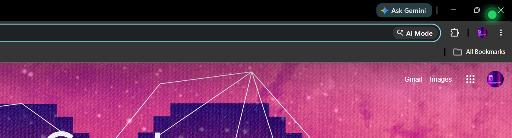

# 🟢 PingDot

> A tiny, always-on-top dot that blinks when a specific WhatsApp contact messages you — without ever opening WhatsApp — regardless of what you're doing on your PC.


---

## What It Does

PingDot sits silently in the corner of your screen invisible. The moment your chosen contact sends you a WhatsApp message, the dot appears and starts pulsing. Click it to dismiss. That's it.

No notifications. No popups. No sound. Just a gentle, ambient signal that someone wants your attention.

---

## Features

- **Always-on-top overlay** — floats above every window, including fullscreen apps
- **Fully click-through** — never gets in your way when idle; only captures clicks when blinking
- **Smart unread tracking** — blinks only on _new_ messages, not on ones you've already seen
- **Dismissable** — click the dot to acknowledge; re-blinks only if more messages arrive
- **Tray icon** — right-click to change contact, open WhatsApp, or quit
- **Configurable** — dot size, position, color, polling interval, and more via `config.json`
- **Portable build** — single `.exe`, no installer required

---

## Screenshot



The dot lives at the edge of your screen. When a message arrives, it pulses green with a soft ripple animation. Hover to see who messaged you. Click to dismiss.

---

## Configuration

Edit `config.json` in the project root to customise behaviour:

```json
{
  "contactName": "John Doe",
  "checkIntervalMs": 1000,
  "dotSize": 22,
  "dotSide": "right",
  "dotY": 16,
  "dotColor": "#25D366",
  "showDotWhenIdle": true
}
```

| Field             | Type                  | Description                                                             |
| ----------------- | --------------------- | ----------------------------------------------------------------------- |
| `contactName`     | `string`              | Name of the contact to watch. Partial matches work (case-insensitive).  |
| `checkIntervalMs` | `number`              | How often (ms) to poll WhatsApp Web for new messages. Default: `1000`.  |
| `dotSize`         | `number`              | Diameter of the dot in pixels. Default: `22`.                           |
| `dotSide`         | `"left"` \| `"right"` | Which edge of the screen to place the dot on.                           |
| `dotY`            | `number`              | Vertical position (px from top of screen).                              |
| `dotColor`        | `string`              | Dot colour as a hex value. Default: WhatsApp green `#25D366`.           |
| `showDotWhenIdle` | `boolean`             | Show a faint dot when idle, or hide completely until a message arrives. |

You can also change the contact at runtime via the tray icon: right-click → **Change Contact…**

---

## How it works

```
WhatsApp Web (hidden window)
  └── preload-whatsapp.js polls the DOM every 2.5s
        └── detects unread badge for your contact
              └── IPC → main.js → tells overlay to blink
```

- Built with **Electron** only (no Puppeteer, no extra Chromium).
- WhatsApp Web runs in a **hidden BrowserWindow** (same session as normal use).
- The overlay is a **frameless, transparent, always-on-top** window that floats over everything.
- Auto-stops blinking when you open WhatsApp and read the message.

---

## Project Structure

```
pingdot/
├── main.js                # Main process: windows, tray, IPC orchestration
├── preload-whatsapp.js    # WhatsApp Web DOM polling (runs in WA window)
├── preload-overlay.js     # IPC bridge for the overlay window
├── overlay.html           # The dot UI (transparent frameless window)
├── config.json            # User configuration
├── package.json
└── assets/
    └── icon.ico           # Tray / app icon
```

---

## Tray Menu

Right-click the tray icon for quick actions:

| Option               | Description                                                      |
| -------------------- | ---------------------------------------------------------------- |
| 👀 Watching: "…"     | Shows which contact is currently monitored (non-clickable label) |
| 💬 Open WhatsApp Web | Brings the hidden WhatsApp window to the front                   |
| ✏️ Change Contact…   | Opens a dialog to update the watched contact name                |
| ⚙️ Open config.json  | Opens the config file in your default text editor                |
| 🔴 Stop blinking     | Manually dismiss the current blink (visible only when blinking)  |
| ❌ Quit              | Fully exits the app                                              |

---

## Troubleshooting

**The dot never blinks even though I have unread messages.**
Make sure `contactName` in `config.json` matches the name shown in WhatsApp Web exactly (or at least partially). Names are matched case-insensitively. Open WhatsApp Web manually to verify the contact name.

**WhatsApp asks me to scan the QR code every time I launch.**
Electron stores the WhatsApp session in `%APPDATA%\PingDot`. This folder persists between launches. If the session keeps expiring, check that the folder hasn't been cleared by a cleanup tool.

**The dot appears on the wrong screen.**
PingDot uses the primary display. Multi-monitor support is not currently implemented.

**The app won't start / shows a cache error.**
Delete `%APPDATA%\PingDot` and restart. The app will re-create it cleanly.

---

## Privacy

PingDot runs entirely on your local machine. No data is sent anywhere. WhatsApp Web is loaded directly in an Electron window using your own WhatsApp account, the same way it works in a browser. The DOM polling happens entirely in the preload script — nothing is intercepted, stored, or transmitted.

---

## Contributing

Issues and pull requests are welcome. For major changes, please open an issue first to discuss what you'd like to change.

---

## Contact

PingDot is built by **Devansh Tyagi**.

- **GitHub:** [devanshtyagi26](https://github.com/devanshtyagi26)
- **LinkedIn:** [tyagi-devansh](https://linkedin.com/in/tyagi-devansh)
- **Email:** [tyagidevansh3@gmail.com](mailto:tyagidevansh3@gmail.com)
- **Portfolio:** [https://devanshportfolio-hazel.vercel.app/](https://devanshportfolio-hazel.vercel.app/)
